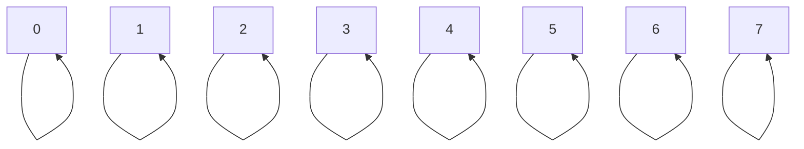
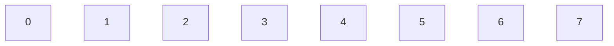
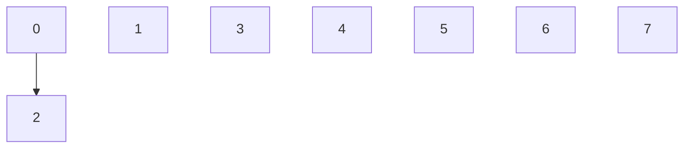
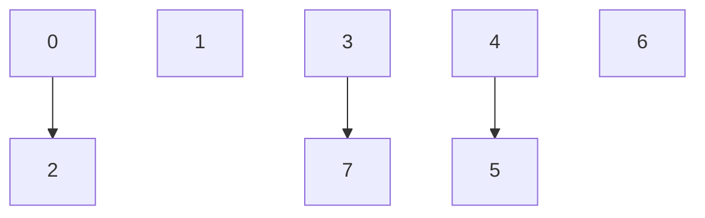
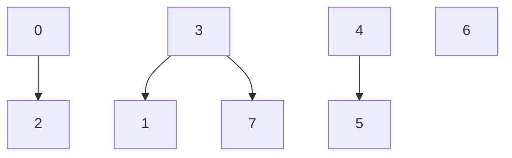

# UnionFind


**Explanation:** The union-find data structure is a form of data representation used to solve problems of connectivity. It has many applications in real life such as social networking, games, least common ancestor, etc. 

As for the term “connectivity”, note that it is a relationship that is both reflexive and transitive, i.e., reflexive: every item is connected to itself; transitive: if A is connected to B, and B is connected to C, then A is connected to C.

Under the hood, the Union-find data structure makes use of an array, however, it is best we apply a tree-like mental model to the linear structure(array) because connectivity isn’t usually linear in the real world. 

---

To get a sound understanding, let’s try to model a real-world system of 8 items where each item is connected to at least one item, i.e., if an item is not connected to any other item, it must at least, be connected to itself (based on the reflexive property of connectivity).

At first, the values of the array will correspond with their index as shown below. The interpretation is that initially, each item is only connected to itself.

| 0 | 1 | 2 | 3 | 4 | 5 | 6 | 7 |
| --- | --- | --- | --- | --- | --- | --- | --- |

What we gave above is a liner model of the system. Let’s apply a tree-like mental model to the linear structure



As can be seen above, each item is connected only to itself, and the non-linear structure is made up of 8 trees where each tree is only made up of its root. For instance, item 0 is only connected to itself, and it is the root of the first tree.

Note: Starting from this point, we would not show the reflexive connection (relationship between an item and itself) in our tree-like models so as to simplify the view.

Now, let’s see what we can build with this. Let’s connect item 0 and item 2. Two items are said to be connected iff they have the same root, i.e., if they are a component of the same tree.

The question is how do we connect 2 items? Well, we follow the steps below

1. Trace the root (not parent) of the first item’s tree
2. Trace the root of the second item’s tree
3. If the roots are the same, then return, because they are already connected. Otherwise
4. Merge the shorter tree into the taller tree if they are of unequal heights, otherwise, just merge the second tree into the first (or first into the second). For the sake of this article, we will always merge the second tree into the first tree when the trees are of equal heights.

The above steps were given in terms of our tree-like mental model of the underlying linear structure. So, how would we implement it using the actual array? First note the following,   

- we only encounter a root in the array when a given value in the array is equal to its index. Therefore, the numbers of trees in a given array is the number of items whose value equals its index.
- When a value is different from its index, the item represented by the value is said to be the parent of the item represented by its index.
- to trace the root of an item represented by a given index, we keep tracking the parents, grandparents, great grandparents, etc., until one of them eventually turn out to be a root.
- the parent of item `i` (where `i` is an integer) is `arr[i]`. the grandparent of `i` is `arr[arr[i]]` and so on
- let the root of item `a` be item `i` (where `arr[i] == i`) and the root of item `b` be item `j` (where `arr[j] == j`), we connect item `a` and item `b` by setting `arr[i] = j` (this is equivalent to merging the first tree into the second tree, as `arr[i]` no longer equals `i`, hence the condition for `i` to be a root no longer holds. Instead, `i` with all its associated children becomes a child of item `j` which leaves `j` as the root of item `a` and item `b`) OR
- we can also do it the other way round, i.e., setting `arr[j] = i` (this is equivalent to merging the second tree into the first tree, as `arr[j]` no longer equals `j`, hence the condition for `j` to be a root no longer holds. Instead, `j` with all its associated children becomes a child of item `i` which leaves `i` as the root of item `a` and item `b`)
- That said, we can connect item `a` and item `b` in any of the two given ways provided above depending on which of the trees - of which item `a` and item `b` are part of - is taller.
- we have made mentions of trees being tall, but how do we know a tree is taller than another. Well, we will keep an extra array with which we would keep track of the height of each tree. Check the code implementation to understand better.

So, based on points we provided above, we can now apply the steps stated for our tree-like model to the underlying linear structure (array).

---

Now let’s go back to our problem of the real-world system consisting of 8 items.

Underlying linear structure (array)

| indexes (items) | 0 | 1 | 2 | 3 | 4 | 5 | 6 | 7 |
| --- | --- | --- | --- | --- | --- | --- | --- | --- |
| values (parents/roots) | 0 | 1 | 2 | 3 | 4 | 5 | 6 | 7 |

height array to hold the height of individual trees

| root of trees | 0 | 1 | 2 | 3 | 4 | 5 | 6 | 7 |
| --- | --- | --- | --- | --- | --- | --- | --- | --- |
| height of tree | 0 | 0 | 0 | 0 | 0 | 0 | 0 | 0 |

Tree-like model



Connecting the item 0 and item 2, we

1. Trace the root of item 0, which is itself (item 0)
2. Trace the root of item 2, which is itself (item 2)
3. is 0 == 2? No, hence we merge the trees into 1 tree
4. They are of equal height, so I would set `arr[2] = 0`

Let’s now have a visual representation of our structures.

Underlying linear structure (array)

| indexes (items) | 0 | 1 | 2 | 3 | 4 | 5 | 6 | 7 |
| --- | --- | --- | --- | --- | --- | --- | --- | --- |
| values (parents/roots) | 0 | 1 | 0 | 3 | 4 | 5 | 6 | 7 |

height array to hold the height of individual trees

| root of trees | 0 | 1 | 2 | 3 | 4 | 5 | 6 | 7 |
| --- | --- | --- | --- | --- | --- | --- | --- | --- |
| height of tree | 1 | 0 | 0 | 0 | 0 | 0 | 0 | 0 |

Tree-like model



---

Let’s do few more connections. Let’s connect item 4 with item 5. Also, let’s connect item 3 with item 7.

Following the steps given earlier to connect two items, we would arrive at the following

Underlying linear structure (array)

| indexes (items) | 0 | 1 | 2 | 3 | 4 | 5 | 6 | 7 |
| --- | --- | --- | --- | --- | --- | --- | --- | --- |
| values (parents/roots) | 0 | 1 | 0 | 3 | 4 | 4 | 6 | 3 |

height array to hold the height of individual trees

| root of trees | 0 | 1 | 2 | 3 | 4 | 5 | 6 | 7 |
| --- | --- | --- | --- | --- | --- | --- | --- | --- |
| height of tree | 1 | 0 | 0 | 1 | 1 | 0 | 0 | 0 |

Tree-like model



---

The above connections have been between two items whose tree length are equal. Let’s now attempt to connect two items with their trees having different lengths. Here, we aim to connect item 1 and item 7.

Let’s go over the steps

1. Trace the root of item 1. Here the root is itself, i.e., item 1.
2. Trace the root of item 7. 
    
    — It is not its own root because `arr[7] !== 7` . So, we must trace its root by following its parent, grandparent, etc., until one turns out to be its own root. That would then be the root of item 7. Let’s go.
    
    - item 7’s parent is `arr[7]` which is equal to 3.
    - item 3’s parent (item 7’s grandparent) is `arr[3]` which is equal to 3.
    - Hurray, we have traced item 7 to its root because we have found a forbear of 7, such that `arr[item] == item` is true (`arr[3]` = 3)
    - Therefore, the root of item 7 is 3 (item 3)
3. Are the roots equal? NO. 1 ≠ 3. Move to step 4
4. check the height array to get the height of items (roots) 1 and 3. The height of item 1 is 0, while the height of item 3 is 1. Therefore, the tree that has item 3 as its root is the taller tree, hence we merge the first tree (tree that has item 1 as its root) into the second tree by setting `arr[1] = 3` . 3 then becomes the root of item 1

Let’s have a visual representation.

Underlying linear structure (array)

| indexes (items) | 0 | 1 | 2 | 3 | 4 | 5 | 6 | 7 |
| --- | --- | --- | --- | --- | --- | --- | --- | --- |
| values (parents/roots) | 0 | 3 | 0 | 3 | 4 | 4 | 6 | 3 |

height array to hold the height of individual trees

| root of trees | 0 | 1 | 2 | 3 | 4 | 5 | 6 | 7 |
| --- | --- | --- | --- | --- | --- | --- | --- | --- |
| height of tree | 1 | 0 | 0 | 1 | 1 | 0 | 0 | 0 |

Tree-like model



More connections can be done, and we can always query the data structure to find out the connection status of two given items.

---

Using Java, let’s implement a weighted-optimized Union-find data structure.

```java
public class UnionFind {

	private int[] items;
	private int[] size;

	public UnionFind(int n) {
		items = new int[n];
		for (int i = 0; i < n; i++) items[i] = i;
		size = new int[n];
	}

	private int root(int item) {
		while (items[item] !== item) {
			// path compression
			//items[item] = items[items[item]];
			item = items[item];
		}
		return item;
	}

	public int find(int item) {
		return root(item);
	}

	public void union(int item1, int item2) {
		int rootItem1 = root(item1);
		int rootItem2 = root(item2);
		// weighting
		if (size[rootItem1] > size[rootItem2]) items[rootItem2] = rootItem1;
		else if (size[rootItem2] > size[rootItem1]) items[rootItem1] = rootItem2;
		else { 
			items[rootItem2] = rootItem1;
			size[rootItem1]++;
		}
	}
	
}
```

Having this data structure in place, one can then use it without knowing its implementation details, by making use of the APIs we exposed, `union` and `find`. The constructor is also public in order to instantiate the data structure.
